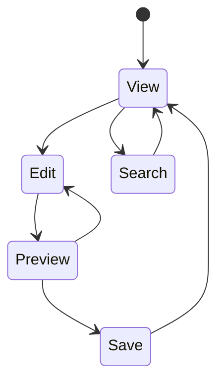

# 📚 Go Wiki

A self-hosted wiki solution built for Dungeon Masters and world builders, focusing on simplicity, privacy, and extensibility.

## Features

- 🔒 **Fine-grained Access Control**
  - Role-based page restrictions
  - Private sections for DM-only content
  - Customizable user groups

- 📝 **Modern Editing**
  - Real-time Markdown preview
  - Image and file attachments
  - Version history and rollback
  - Page templates

- 🔍 **Smart Organization**
  - Full-text search
  - Custom taxonomies
  - Automatic linking
  - Tags and categories

- 🛠 **Integration Ready**
  - RESTful API
  - WebSocket support
  - Webhook notifications
  - Custom metadata

## Quick Start

```bash
# Clone the repository
git clone https://github.com/Yawning-Portal/wiki

# Start with Docker
docker-compose up -d

# Or build from source
go build ./cmd/wiki
./wiki
```

Visit `http://localhost:8080` and start writing!

## Motivation

After extensive experience with existing solutions like WorldAnvil and Fandom, we identified several pain points:

| Platform  | Challenges |
|-----------|------------|
| WorldAnvil | - Cumbersome UI<br>- Slow development cycle<br>- Paid service |
| Fandom    | - Complex setup<br>- Limited access controls<br>- Ads and branding |

Go Wiki aims to provide:
- Simple, intuitive interface
- Fast, responsive editing
- Granular privacy controls
- Self-hosted solution
- Open-source flexibility

## Architecture



## Development

Requirements:
- Go 1.21+
- PostgreSQL
- Redis (optional)

```bash
# Install dependencies
make setup

# Run development server
make dev

# Run tests
make test
```

## Documentation

- [📘 User Guide](./docs/user/index.md)
- [🛠 Developer Guide](./docs/developer/index.md)
- [🔌 API Reference](./docs/api/index.md)
- [🎨 Theme Guide](./docs/themes/index.md)

## Deployment

Supported deployment methods:
- Docker
- Kubernetes
- Binary release
- From source

See [Deployment Guide](./docs/deployment/index.md) for details.

## Contributing

We welcome contributions! Please see our [Contributing Guide](CONTRIBUTING.md) for details.

## Roadmap

- [x] Basic wiki functionality
- [x] User authentication
- [x] Markdown support
- [ ] Real-time collaboration
- [ ] Plugin system
- [ ] API v2
- [ ] Mobile app

## License

MIT License - see [LICENSE](LICENSE)

## Acknowledgments

- Initial implementation inspired by the [Go Wiki Tutorial](https://go.dev/doc/articles/wiki/)
- Community feedback and contributions
- Open source packages listed in [CREDITS.md](CREDITS.md)

---
*Built with ❤️ for the TTRPG community*
